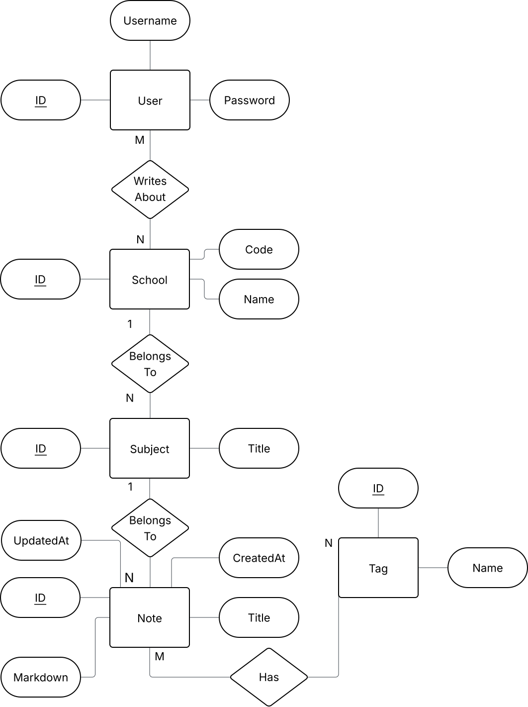

# My Fullstack Blog

## EER


## Local Development

### Frontend

To run the frontend there is a Makefile command that handles this. 

```
make run-frontend
```
This will run the Vite server in development mode.

### Backend

#### Database 

First, we must run the database for the backend to talk to. We run the Makefile command:

```
make run-db
```

This will run the database and run the migrator as well to populate the database with initial data.

To stop the database, run the Makefile command:

```
make stop
```

#### Server

To run the server, type the Makefile command:

```
make run-backend
```

